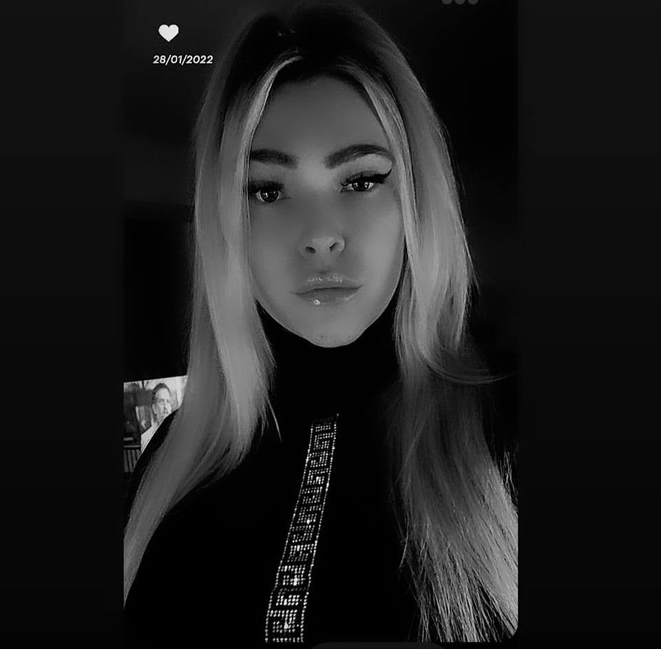

# Amandine
*L'enseignement de l'informatique ne peut faire de personne un programmeur expert plus que l'étude des pinceaux et du pigment peut faire de quelqu'un un peintre expert.*

## Motivée, débordante d'énérgie, je suis une personne dynamique malgré des difficultés liées au tdah, j'essaye de 
Créez une table avec la structure suivante :

Anniversaire: 09/07
Sexe: femme
Couleur préférée: Bleu
Nourriture préférée: Steack
Pinneapple sur pizza: Oui / Non (Défi supplémentaire: faites-le ressembler à une case à cocher (non) cochée)

### Passe-temps
Cela devrait contenir une liste à puces de vos passe-temps.
Au moins sur l’élément devrait contenir une sous-liste, par exemple si vous aimez les films, peut-être faire une sous-liste de certains films que vous aimez vraiment.

#### Vous pouvez toujours compter sur moi lorsque 
Dites à vos coéquipiers quelle contribution positive au groupe vous allez apporter.
Cela pourrait être technique, mettre les gens à l’aise, être un organisateur...

##### Une histoire drôle
Racontez une courte histoire drôle sur votre vie.

###### TL;DR 
Estimez votre histoire drôle en une courte phrase.

Au bas de la page, il devrait y avoir un lien suivant et précédent, cela devrait renvoyer à la page de l’étudiant précédent (par ordre alphabétique) et à la suivante.
Organisez-vous de manière à ce qu’il soit facile de savoir à qui vous devez vous lier.

Les liens doivent avoir la structure suivante :

<< || précédente VOTRE NOM || >> suivant